<!-- sample:标题与段落 -->

# 一级标题

## 二级标题

### 三级标题

#### 四级标题

##### 五级标题

###### 六级标题

这是第一段正文，用于观察段落宽度、字号、行高、字间距与首行缩进。

这是第二段正文。下面使用两个行尾空格产生硬换行。  
这一行应紧跟上一行显示，但仍然位于同一段落中。

---

> 普通引用第一层
>
> > 嵌套引用第二层

<!-- sample:行内与扩展 -->

普通文本、**粗体aBc123**、_斜体aBc123_、**_粗斜体aBc123_**、~~删除线~~、==高亮文本==。

行内代码 `const answer = 42`，转义字符 \*不会变成斜体\*。

上标：X^2^；下标：H~2~O；Emoji：:smile: :tada: :warning:。

Ruby 注音：{小森|コモリ}、{远方|yuǎnfāng}、{汉字|かんじ}。

HTML 和 CSS 都可以使用缩写提示。

_[HTML]: HyperText Markup Language
_[CSS]: Cascading Style Sheets

这是一段签名样式测试。{.signature}

## 带自定义 ID 的标题 {#custom-heading}

[跳转到自定义标题](#custom-heading)

<!-- sample:列表与复选框 -->

## 无序列表

- 一级项目 A
  - 二级项目 A.1
    - 三级项目 A.1.1
- 一级项目 B

## 有序列表

1. 第一步
2. 第二步
   1. 子步骤
   2. 另一个子步骤
3. 第三步

## 任务列表与替代复选框

- [x] 已完成任务
- [ ] 未完成任务
- [x] 包含 **粗体** 与 `code` 的任务
- [-] 已取消/已放弃
- [/] 进行中
- [>] 推迟/后续
- [<] 计划中
- [?] 疑问/需要讨论
- [!] 重要/紧急
- [*] 笔记/备忘
- ["] 引用
- [l] 位置/地点
- [b] 书签
- [i] 信息
- [S] 金额/花费
- [p] 奖励/成就
- [c] 待选/备选

<!-- sample:链接与媒体 -->

## 链接

[站内首页](/)、[GitHub](https://github.com) 与自动链接 <https://komori.cc/>。

这是一个带标题的链接：[Markdown 指南](https://www.markdownguide.org/ "打开 Markdown 指南")。

[引用式链接][docs]

[docs]: https://www.markdownguide.org/

## 图片


图片下方正文用于检查图片尺寸、间距和加载后的布局稳定性。

<!-- sample:表格 -->

## 对齐与行内格式

| 左对齐                     |            居中             | 右对齐 | 混合内容             |
| :------------------------- | :-------------------------: | -----: | -------------------- |
| 普通文本                   |          **粗体**           | 123.45 | `inline code`        |
| 较长内容用于测试列宽和换行 | [链接](https://example.com) |  9,999 | ~~删除~~ 与 ==高亮== |
| 中文标点：，。！？         |           :smile:           |    -42 | H~2~O 与 X^2^        |

表格下方正文用于检查滚动容器与上下间距。

<!-- sample:代码块 -->

行内代码：`npm run build`。

```javascript
const add = (a, b) => a + b;
console.log(add(2, 3));
```

```typescript
function greet(name: string): string {
  return `Hello, ${name}!`;
}
console.log(greet("KoMoriSam"));
```

```python
def greet(name: str) -> str:
    return f'Hello, {name}!'

print(greet('KoMoriSam'))
```

```java
public class Main {
    public static void main(String[] args) {
        System.out.println("Hello, Java!");
    }
}
```

```go
package main

import "fmt"

func main() {
    fmt.Println("Hello, Go!")
}
```

```rust
fn main() {
    println!("Hello, Rust!");
}
```

```ruby
def greet(name)
  "Hello, #{name}!"
end

puts greet('KoMoriSam')
```

```php
<?php
function greet(string $name): string {
    return "Hello, {$name}!";
}

echo greet('KoMoriSam');
```

```c
#include <stdio.h>

int main(void) {
    printf("Hello, C!\n");
    return 0;
}
```

```c++
#include <iostream>

int main() {
    std::cout << "Hello, C++!" << std::endl;
    return 0;
}
```

```csharp
using System;

class Program
{
    static void Main()
    {
        Console.WriteLine("Hello, C#!");
    }
}
```

```html
<!doctype html>
<html lang="zh-CN">
  <head>
    <meta charset="UTF-8" />
    <title>Test</title>
  </head>
  <body>
    <h1>Hello, HTML!</h1>
  </body>
</html>
```

```css
.card {
  display: grid;
  gap: 1rem;
  border-radius: 0.75rem;
}
```

```scss
$primary: #3b82f6;

.button {
  color: $primary;

  &:hover {
    opacity: 0.8;
  }
}
```

```sass
$primary: #3b82f6

.button
  color: $primary

  &:hover
    opacity: .8
```

```json
{
  "name": "KoMoriSam",
  "enabled": true,
  "tags": ["vue", "markdown"]
}
```

```xml
<?xml version="1.0" encoding="UTF-8"?>
<user>
  <name>KoMoriSam</name>
  <enabled>true</enabled>
</user>
```

```yaml
name: KoMoriSam
enabled: true
tags:
  - vue
  - markdown
```

```markdown
# 标题

这是一段包含 **粗体**、_斜体_ 和 `code` 的 Markdown。

- 项目一
- 项目二
```

```sql
SELECT id, name
FROM users
WHERE enabled = TRUE
ORDER BY id DESC;
```

```shell
npm install
npm run build
echo "Build complete"
```

```bash
#!/usr/bin/env bash

name="KoMoriSam"
echo "Hello, $name!"
```

```sh
#!/bin/sh

for file in *.md; do
  echo "$file"
done
```

```dockerfile
FROM node:24-alpine

WORKDIR /app
COPY package*.json ./
RUN npm ci

COPY . .
CMD ["npm", "run", "dev"]
```

```nginx
server {
    listen 80;
    server_name example.com;

    location / {
        try_files $uri $uri/ /index.html;
    }
}
```

```vue
<template>
  <button @click="count++">
    {{ count }}
  </button>
</template>

<script setup>
import { ref } from "vue";

const count = ref(0);
</script>
```

```react
import { useState } from "react";

export default function Counter() {
  const [count, setCount] = useState(0);

  return (
    <button onClick={() => setCount(count + 1)}>
      {count}
    </button>
  );
}
```

```angular
import { Component } from "@angular/core";

@Component({
  selector: 'app-root',
  template: `<h1>{{ title }}</h1>`,
})
export class AppComponent {
  title = 'Hello, Angular!';
}
```

```swift
let name = "KoMoriSam"
print("Hello, \(name)!")
```

```kotlin
fun main() {
    val name = "KoMoriSam"
    println("Hello, $name!")
}
```

```dart
void main() {
  const name = 'KoMoriSam';
  print('Hello, $name!');
}
```

```perl
use strict;
use warnings;

my $name = "KoMoriSam";
print "Hello, $name!\n";
```

```lua
local name = "KoMoriSam"
print("Hello, " .. name .. "!")
```

```r
name <- "KoMoriSam"
cat(sprintf("Hello, %s!\n", name))
```

```scala
object Main extends App {
  val name = "KoMoriSam"
  println(s"Hello, $name!")
}
```

```haskell
main :: IO ()
main = putStrLn "Hello, Haskell!"
```

```elixir
name = "KoMoriSam"
IO.puts("Hello, #{name}!")
```

```erlang
-module(hello).
-export([main/0]).

main() ->
    io:format("Hello, Erlang!~n").
```

```clojure
(def name "KoMoriSam")
(println (str "Hello, " name "!"))
```

```crystal
name = "KoMoriSam"
puts "Hello, #{name}!"
```

```zig
const std = @import("std");

pub fn main() !void {
    std.debug.print("Hello, Zig!\n", .{});
}
```

```diff
- const enabled = false;
+ const enabled = true;
```

```plaintext
这是显式声明为 plaintext 的代码块。
用于测试纯文本语言标识和 fallback 图标。
```

```
这是没有声明语言的代码块。
用于检查无语言 fallback 与复制按钮。
```

<!-- sample:提示与折叠 -->

> [!NOTE] 普通说明 `Markdown 格式支持` [^1]
> 静态说明块，支持 **Markdown** 与 `行内代码`。

> [!TIP]+ 默认展开
> 这是可以折叠的提示块。
>
> - 支持列表
> - 支持多段内容

> [!WARNING]- 默认折叠
> 点击标题后才能看到这段警告内容。

> [!CAUTION] 危险操作
> 请确认 error 语义色、图标与正文对比度。

> [!SUCCESS] 操作成功
> success 类型的渲染效果。

> [!QUOTE] 自定义引用
> 用于区别普通 blockquote 与项目提示块。

[^1]: 用于区别普通 blockquote 与项目提示块。

<!-- sample:脚注与锚点 -->

# 可跳转的测试标题

标题右侧应生成无障碍锚点。[跳转到标题](#可跳转的测试标题)

这是数字脚注[^1]，这是命名脚注[^note]。同一个脚注可以再次引用[^1]。

脚注中可以包含 **粗体**、链接和多段内容。[^long]

[^1]: 第一条脚注内容。

[^note]: 命名脚注会按照出现顺序编号。

[^long]: 第一段脚注，包含 [外部链接](https://example.com)。

    第二段脚注，用于检查缩进和返回链接。

<!-- sample:数学公式 -->

## 行内公式

质能方程 $E = mc^2$ 应与正文基线对齐，勾股定理为 $a^2 + b^2 = c^2$。

## 块级公式

$$
a^2 + b^2 = c^2
$$

$$
f(x) = x^3 + 2x^2 - x + 1
$$

公式后的正文用于检查异步加载 MathJax SVG 时是否闪烁或丢失内容。

好的，我们来做一个“压力测试”级别的公式，它混合了大型矩阵、分段函数、上下标嵌套、积分、求和与极限，能有效检验渲染引擎的边界情况。

---

### 行内公式压力测试

这是一个同时包含多重上下标、分数和根号的复杂行内公式：  
$\displaystyle \lim_{n \to \infty} \left( 1 + \frac{1}{n} \right)^{n} = e$，而微分形式则为 $\displaystyle \frac{\partial^2 u}{\partial t^2} = c^2 \nabla^2 u$，同时包含张量缩并：$R^{\mu}_{\ \nu \rho \sigma} = \partial_\rho \Gamma^{\mu}_{\nu\sigma} - \partial_\sigma \Gamma^{\mu}_{\nu\rho} + \Gamma^{\mu}_{\lambda\rho} \Gamma^{\lambda}_{\nu\sigma} - \Gamma^{\mu}_{\lambda\sigma} \Gamma^{\lambda}_{\nu\rho}$。

---

### 块级公式巨型组合

下面是一个包含 **5×5 矩阵**、**分段函数**、**多重积分** 和 **求和极限** 的复合公式，用于测试渲染性能与布局稳定性：

$$
\begin{aligned}
& \text{1. 大型矩阵：} \\
& \mathbf{M} =
\begin{pmatrix}
\dfrac{\partial^2 f}{\partial x_1^2} & \dfrac{\partial^2 f}{\partial x_1 \partial x_2} & \cdots & \dfrac{\partial^2 f}{\partial x_1 \partial x_5} \\
\dfrac{\partial^2 f}{\partial x_2 \partial x_1} & \dfrac{\partial^2 f}{\partial x_2^2} & \cdots & \dfrac{\partial^2 f}{\partial x_2 \partial x_5} \\
\vdots & \vdots & \ddots & \vdots \\
\dfrac{\partial^2 f}{\partial x_5 \partial x_1} & \dfrac{\partial^2 f}{\partial x_5 \partial x_2} & \cdots & \dfrac{\partial^2 f}{\partial x_5^2}
\end{pmatrix} \\[2.5em]
& \text{2. 分段定义函数：} \\
& g(x) =
\begin{cases}
\exp\left(-\dfrac{1}{1-x^2}\right), & |x| < 1 \\[1.2em]
0, & |x| \ge 1
\end{cases} \\[2.5em]
& \text{3. 多重积分与求和：} \\
& \mathcal{I} = \int_{0}^{\infty} \int_{-\infty}^{+\infty}
\left( \sum_{n=1}^{\infty} \frac{(-1)^{n+1}}{n!} \, x^{2n} \, e^{-y^2} \right)
\, dx \, dy \\[1.5em]
& \text{4. 带约束的极限：} \\
& \mathcal{L} = \lim_{\substack{a \to 0^+ \\ b \to \infty}}
\left[ \frac{1}{b-a} \int_{a}^{b} \frac{\sin t}{t} \, dt \right] = \frac{\pi}{2}
\end{aligned}
$$

---

### 额外：超大嵌套公式（含矩阵内分数、根号、上下标链）

$$
\boxed{
\Psi(x,t) =
\sqrt{\frac{2}{\pi}}
\left(
\frac{
\displaystyle \sum_{k=0}^{\infty} \frac{(-1)^k}{(2k+1)!} x^{2k+1}
}{
\displaystyle \prod_{j=1}^{k} \left( 1 + \frac{1}{j^2} \right)
}
\right)
\cdot
\exp\left[ -i \left( \omega t - \frac{x^2}{2R} \right) \right]
}
$$

<!-- sample:Mermaid -->

## 流程与交互

### 流程图

检查不同节点形状、分支标签、子图、长短文字和连线箭头。

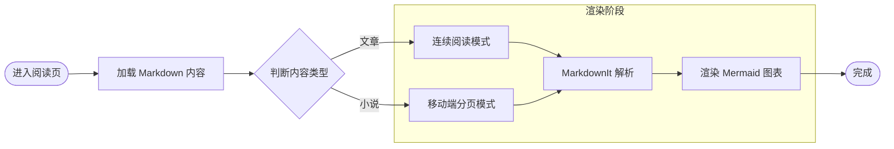

### 时序图

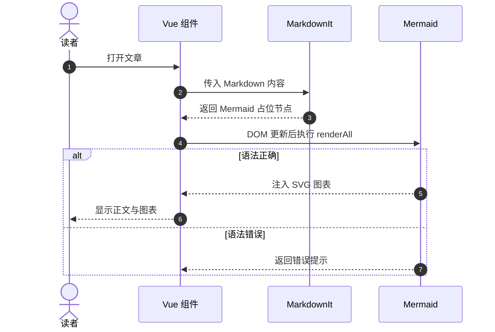

## 结构建模

### 类图

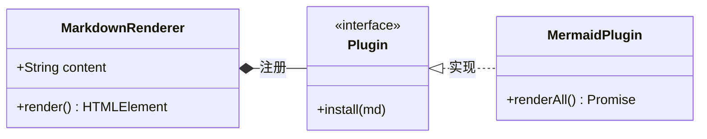

### 状态图

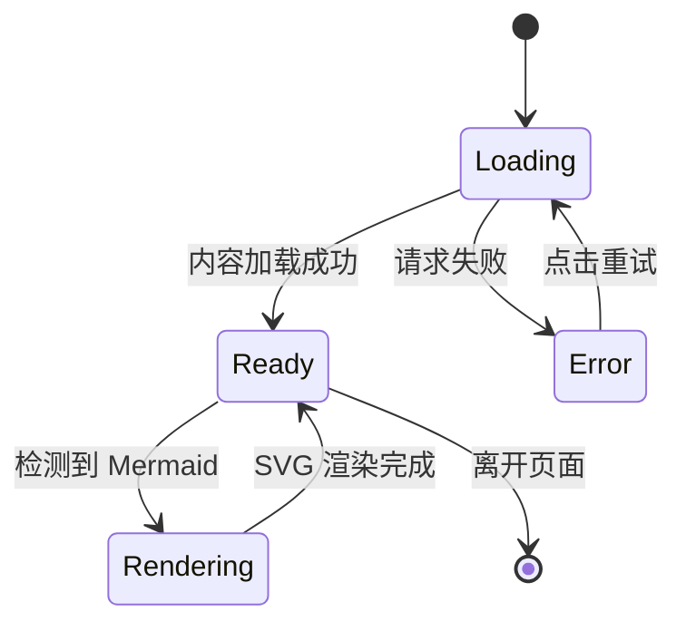

### ER 图

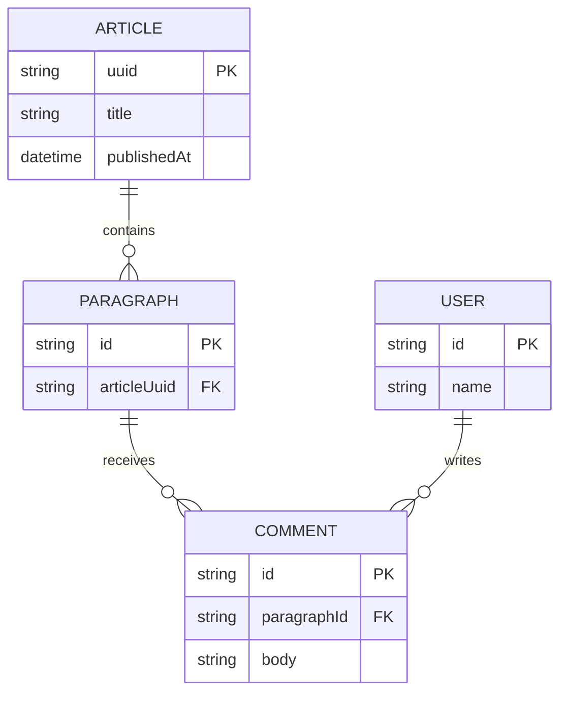

## 计划与数据

### 甘特图

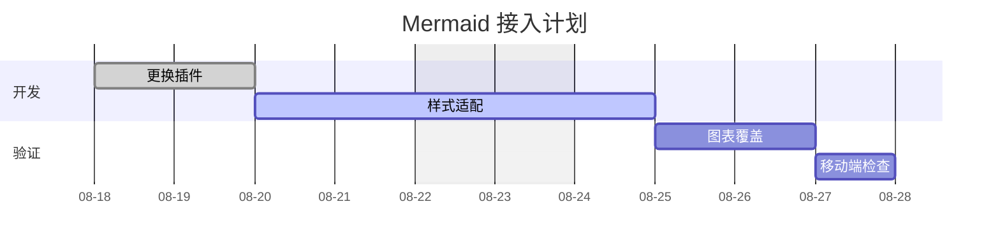

### 饼图

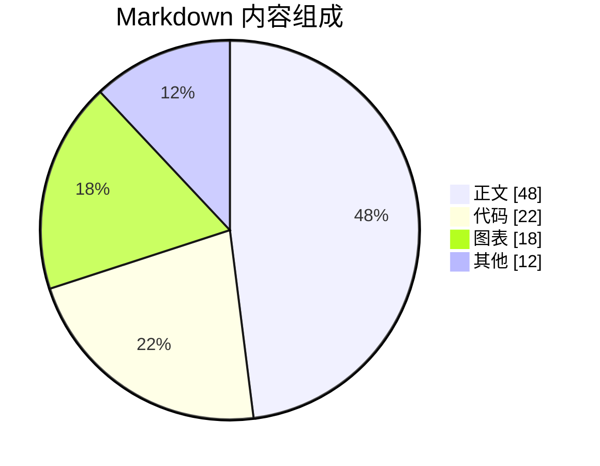

### 四象限图

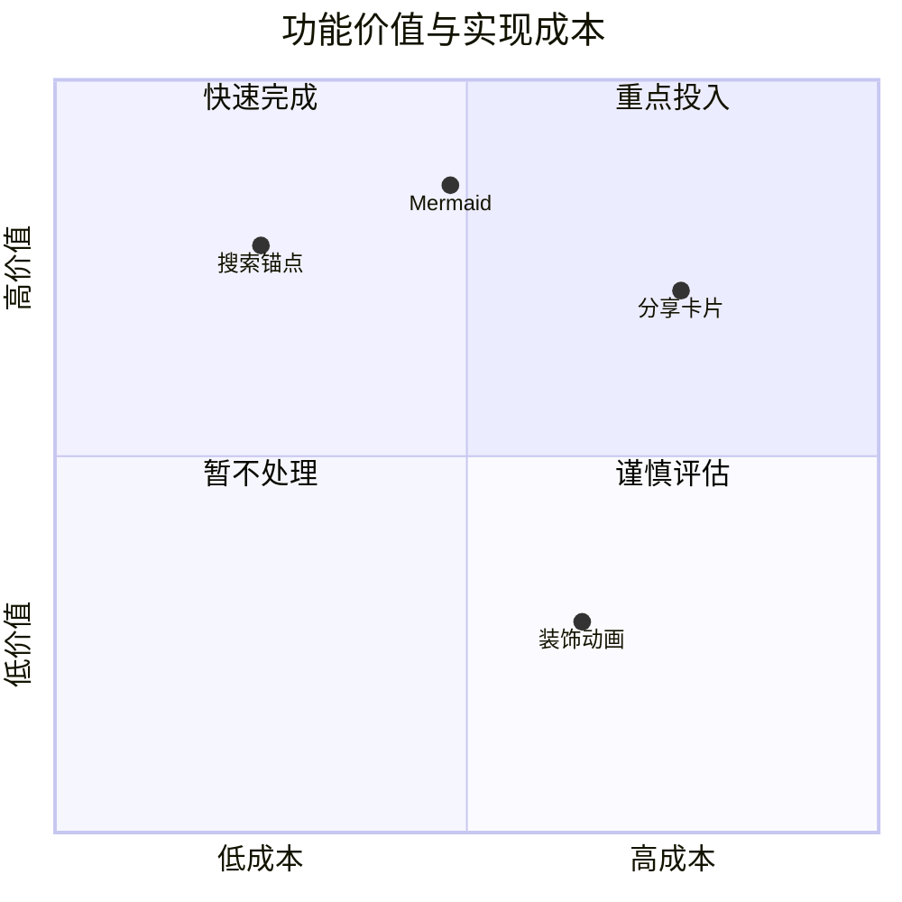

### XY 图

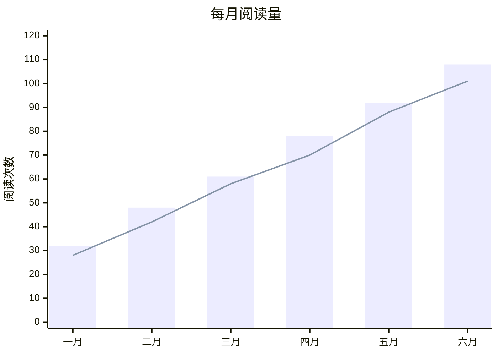

## 项目视图

### Git 分支图

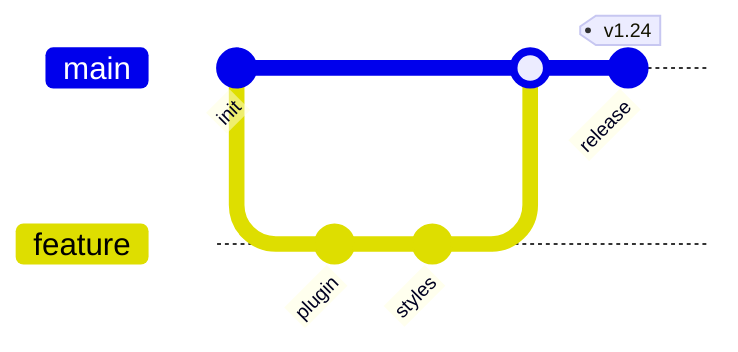

### 思维导图

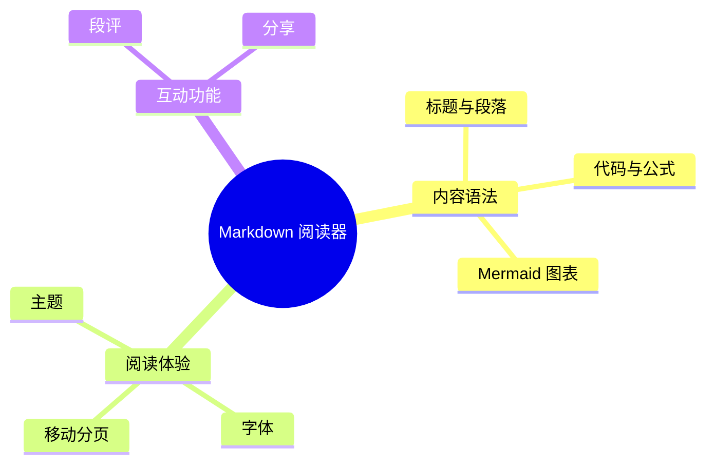

### 时间线

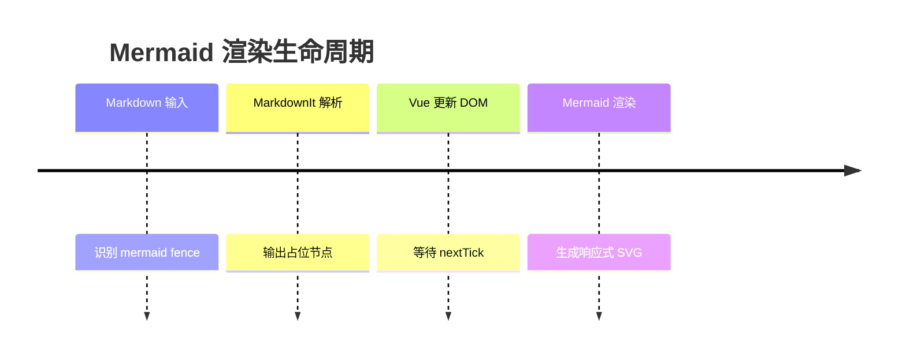

### 用户旅程

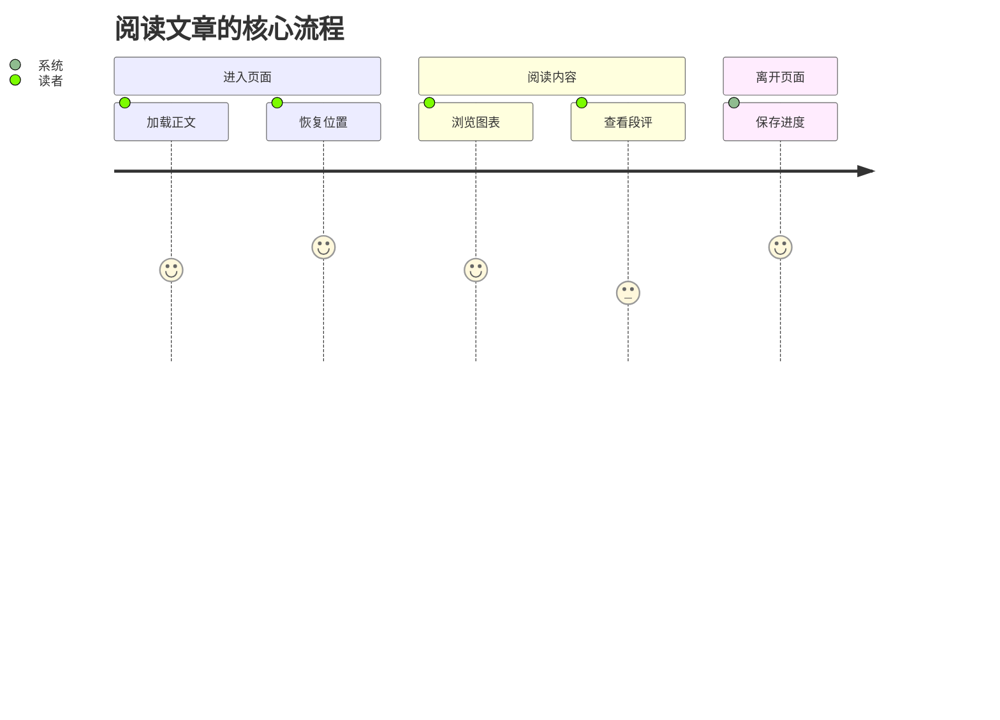

## 现代图表

### 架构图

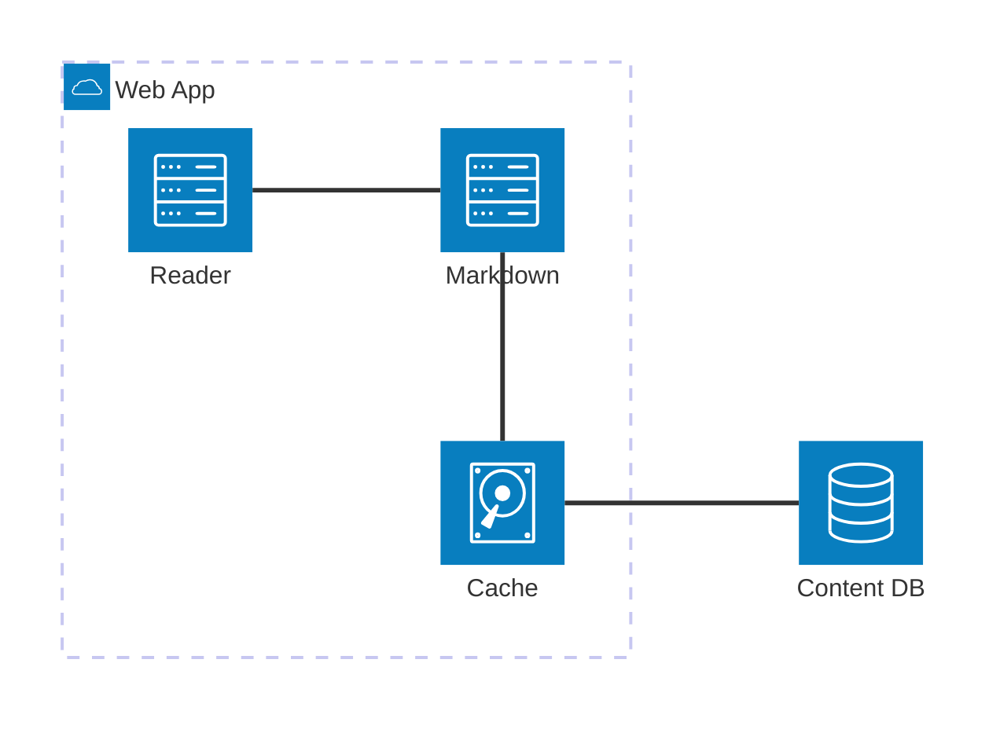

### 块图

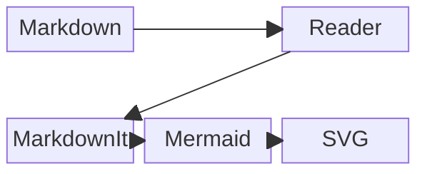

### 看板

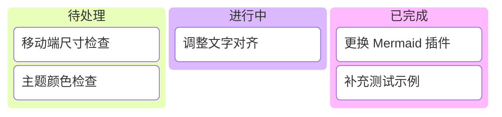

## 渲染错误

```mermaid
block
```

```mermaid
kanban
```

<!-- sample:原生 HTML -->

## HTML 混排

<u>下划线文本</u>、<small>小号文本</small> 与 <del>删除文本</del>。

<details>
  <summary>点击展开原生 details</summary>
  <p>这里包含 <strong>HTML 粗体</strong> 和 <code>HTML code</code>。</p>
</details>

<div title="悬停提示">带有 title 属性的块级 HTML。</div>

HTML 后的 **Markdown 正文** 应继续正常解析。

<!-- sample:聊天记录 -->

> [!chat] **李焰老师** · 在线
>
> > **Mori** 10:30 · 已送达
> > 老师，这是包含 **粗体**、`代码` 和 [链接](https://example.com) 的消息。
>
> 对方已加入会话
>
> > **李焰老师** 10:31 · 已读 · 👍
> > 收到，聊天气泡与状态徽章渲染正常。
> >
> > 第二行消息用于测试气泡内的多段内容。

## 仅聊天消息（无 ChatBar）

> > [!chat] **Mori** 10:30 · 已送达
> > 康神开播了，真的假的😲

<!-- sample:空间动态 -->

> [!moment] **Mori** · 2026-08-06 10:30 · 昆明
>
> 今天在测试自定义 **空间动态** 渲染，正文支持 `Markdown` 和 :tada:。
>
> 
>
> ❤️ 12 · 💬 2 · 🔁 3
>
> **评论**
>
> - **李焰老师** 10:35：渲染效果不错。
>   - **Mori** 回复 **李焰老师** 10:36：收到，谢谢！
> - **小群主** 10:40：评论也支持 **行内格式**。

<!-- sample:边界情况 -->

## 中英文与标点

中文English混排，数字1234567890，全角标点：，。！？；：“”‘’（）【】——……

超长连续文本用于检查换行：LooooooooooooooooooooooooooooooooooooooooooooooooooooooooooooooooongWord

特殊字符：& < > © ™，以及已经转义的 HTML：&lt;script&gt;alert('safe')&lt;/script&gt;。

连续分隔线：

---

---

空链接 [空目标]()、不存在的图片 。
